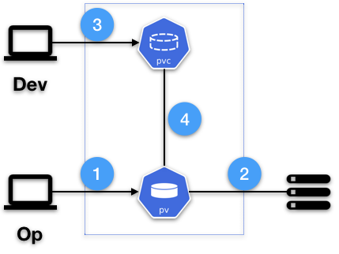
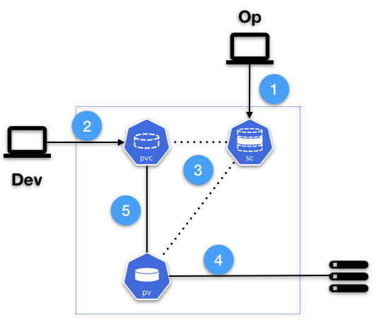

# Kubernetes Volumes

- [Introduction](#Introduction)
- [Volumes](#Volumes)
- [Persistent Volumes Overview](#Persistent-Volumes-Overview)
  - [Persistent Volumes](#Persistent-Volumes)
  - [Persistent Volumes Claim](#Persistent-Volumes-Claims)
  - [Provision](#Provision)
    - [Static Provision](#Static-Provision)
    - [Dynamic Provision](#Dynamic-Provision)
      - [Storage Class](#Storage-Class)
  - [Binding](#Binding)
- [Expand a PVC](#Expand-a-PVC)
- [Lab](#Lab)
  - [SC](#SC)
    - [Get SC](#Get-SC)
    - [Create SC](#Create-SC)
    - [Edit SC](#Edit-SC)
      - [Edit SC imperative](#Edit-SC-imperative)
      - [Edit SC directly](#Edit-SC-directly)
      - [Edit SC declaritive](#Edit-SC-declaritive)
    - [Mark SC as default](#Mark-SC-as-default)
    - [Delete SC](#Delete-SC)
  - [PVC](#PVC)
    - [Get PVC](#Get-PVC)
    - [Create PVC](#Create-PVC)
    - [Edit PVC (expand)](#Edit-PVC-(expand))
    - [Delete PVC](#Delete-PVC)

## Introduction

This document will provide an overview of concepts around Kubernetes Volume.

Files inside a container are, like the container itself, ephemeral. This means that whenever a container start it will start with the same set of files given in the image build and whenever a container gets recreated it will revert back to that state.

Some times there is a need to persist some data, or even share some between different containers.

In the [Lab](#Lab) we will show a step-by-step of the process of using [Dynamic Provision](#Dynamic-Provision) and also how to [Expand a PVC](https://kubernetes.io/docs/concepts/storage/persistent-volumes/#expanding-persistent-volumes-claims) works.

> **NOTE**: You can only use the volume expansion feature to grow a Volume, not to shrink it!

## Volumes

[Volumes](https://kubernetes.io/docs/concepts/storage/volumes/) is the way in Kubernetes to address this requirement and supporst various [type](https://kubernetes.io/docs/concepts/storage/volumes/#types-of-volumes).

Nonetheless, for a so called Dev user it will be troublesome to input all the detailed needed to point torwards an existing external volume. For these we will focus on [persistentVolumeClaim](https://kubernetes.io/docs/concepts/storage/volumes/#persistentvolumeclaim), in order to abstract that info from the user.

## Persistent Volumes Overview

For a basic understanding of [Persistent Volumes](https://kubernetes.io/docs/concepts/storage/persistent-volumes/) (PV).

### Persistent Volumes

PV are a resource in the cluster just like a node is a cluster resource.

PVs are volume plugins like Volumes, but have a lifecycle independent of any individual Pod that uses the PV.

This API object captures the details of the implementation of the storage, be that NFS, iSCSI, or a cloud-provider-specific storage system.

### Persistent Volumes Claims

[Persistent Volumes Claims](https://kubernetes.io/docs/concepts/storage/persistent-volumes/#persistentvolumeclaims) (PVC) are a request for storage by a user.

It is similar to a Pod. Pods consume node resources and PVCs consume PV resources. Pods can request specific levels of resources (CPU and Memory).

Claims can request specific size and access modes (e.g., they can be mounted once read/write or many times read-only).

### Provision

There are two ways PVs may be provisioned: statically or dynamically.

#### Static Provision

A cluster administrator creates a number of PVs. They carry the details of the real storage, which is available for use by cluster users. They exist in the Kubernetes API and are available for consumption.



1. An `op` user, usually an `admin` creates a PV in the cluster with all the details about the existing storage device.
1. Based on the details input in the PV, the storage plugins connects the PV to the storage device.
1. An user, usually a `dev`, creates a PVC with a specific amount of storage requested and with certain access modes.
1. A control loop in the master watches for new PVCs, finds a matching PV (if possible), and binds them together.

> The binding of the PV to a PVC will always guarantee at least what was describe in the PVC, but the volume may be in excess of what was requested.

#### Dynamic Provision

In Static Provision an `op`, usualy an `admin`, needs to take care of provisioning the actual storage (cloud, on-prem, etc.) and then create several PV in order to be able to answer PVC requests from the `dev` team. Still a lot of work an overhead.

To make the process easier and 'dynamic' the `admin` can add [Storage Classes](https://kubernetes.io/docs/concepts/storage/storage-classes/)(SC).

Dynamic provisioning can be enabled on a cluster such that all claims are dynamically provisioned if no storage class is specified.

For these we need to check if [DefaultStorageClass](https://kubernetes.io/docs/reference/access-authn-authz/admission-controllers/#defaultstorageclass) admission controller is enabled on the API server.

A default [Storage Class](https://kubernetes.io/docs/concepts/storage/storage-classes/) must also exists.

##### Storage Class

An SC provides a way for an `admin` to describe the 'classes' of storage that are offer inside the cluster. Different classes might map to different:

- [provisioners](https://kubernetes.io/docs/concepts/storage/storage-classes/#provisioner)
- QoS levels
- backup policies
- ...

The next diagram shows how a [dynamic provision](https://kubernetes.io/docs/concepts/storage/dynamic-provisioning/) works:



1. An `op` user, usually an `admin` creates a SC in the cluster with all the details about the storage provider and the parameters for QoS and other policies.
1. An user, usually a `dev`, creates a PVC with a specific amount of storage requested and with certain access modes and the reference to that SC.
1. The SC is then trigger and creates the needed PV.
1. Based on the details requested, the storage plugins connects the PV to the storage device.
1. In dynamic provision the newly created PV will always be bound by the PVC that triggered the SC.

### Binding

Once bound, PVC binds are exclusive, regardless of how they were bound. A PVC to PV binding is a one-to-one mapping.

Claims will remain unbound indefinitely if a matching volume does not exist.

> A cluster provisioned with many 50Gi PVs would not match a PVC requesting 100Gi. The PVC can be bound when a 100Gi PV is added to the cluster.

## Expand a PVC

Support for expanding PVCs is enabled by default since v1.11.

At the current version, v.1.17, it can be done in the following types of [volumes](https://kubernetes.io/docs/concepts/storage/volumes/) only:

|volume type |Required Kubernetes version|
|---|---|
|[GCEPersistentDisk](https://kubernetes.io/docs/concepts/storage/storage-classes/#gce-pd)|v.11|
|[AWSElasticBlockStore](https://kubernetes.io/docs/concepts/storage/storage-classes/#aws-ebs)|v.11|
|[Cinder](https://kubernetes.io/docs/concepts/storage/storage-classes/#openstack-cinder)|v.11|
|[Glusterfs](https://kubernetes.io/docs/concepts/storage/storage-classes/#glusterfs)|v.11|
|[RBD](https://kubernetes.io/docs/concepts/storage/storage-classes/#ceph-rbd)|v.11|
|[Azure File](https://kubernetes.io/docs/concepts/storage/storage-classes/#azure-file)|v.11|
|[Azure Disk](https://kubernetes.io/docs/concepts/storage/storage-classes/#azure-disk)|v.11|
|[Portworx](https://kubernetes.io/docs/concepts/storage/storage-classes/#portworx-volume)|v.11|
|FlexVolumes|v.13|
|CSI|1.14 (alpha), 1.16 (beta)|

In order to expand a PVC its SC `allowVolumeExpansion` field must be set to `True`.

You can only resize volumes containing a file system if the file system is `XFS`, `Ext3`, or `Ext4`.

> When a volume contains a file system, the file system is only resized when a new Pod is using the PVC in `ReadWrite` mode.

File system expansion is either done when a Pod is starting up or when a Pod is running and the underlying file system supports online expansion.

> Expanding in-use PVCs is available as beta since Kubernetes v1.15, and alpha since v1.11, the `ExpandInUsePersistentVolumes` [feature](https://kubernetes.io/docs/reference/command-line-tools-reference/feature-gates/) must be enabled.

After all requirments are guarantee we can resize the PVC just by changing the PVC storage requested.

## Lab

For the lab we are going to run it in [Google Kubernetes Engine (GKE)](https://cloud.google.com/kubernetes-engine).

> We are leaving RBAC and namespaces out of the lab. Keep in mind that in a production environment they must be enforced.

### SC

#### Get SC

We can check the existing SC by running:

```code
$ kubectl get sc
standard (default)   kubernetes.io/gce-pd   76d
$
```

In our case we only have one, we can get more info with:

```code
$ kubectl describe sc standard
Name:                  standard
IsDefaultClass:        Yes
Annotations:           storageclass.kubernetes.io/is-default-class=true
Provisioner:           kubernetes.io/gce-pd
Parameters:            type=pd-standard
AllowVolumeExpansion:  True
MountOptions:          <none>
ReclaimPolicy:         Delete
VolumeBindingMode:     Immediate
Events:                <none>
$
```

#### Create SC

The one above show us that the type of the disk is the `pd-standard`. If we wanted to create a 'faster' class we could create a new one using the `pd-ssd`.

Create a `sc-faster.yml` with the content:

```yaml
---
apiVersion: storage.k8s.io/v1
kind: StorageClass
metadata:
  name: faster
provisioner: kubernetes.io/gce-pd
parameters:
  type: pd-ssd
allowVolumeExpansion: False
```

> This is a short version, check the [docs](https://kubernetes.io/docs/concepts/storage/storage-classes/#gce-pd) for a compreensive list of parameters.

And apply it running:

```code
kubectl apply -f sc-faster.yml
```

#### Edit SC

For us to edit the SC, for example tweaking the `allowVolumeExpansion` we can:

##### Edit SC imperative

Non recommended but you can just run:

```code
$ kubectl patch sc faster -p '{"allowVolumeExpansion":true}'
storageclass.storage.k8s.io/faster patched
$
```

##### Edit SC directly

Non recommended but you can just run:

```code
kubectl edit sc faster
```

It will open the SC object in `yaml` format, edit and save.

##### Edit SC declaritive

The recommend way is to store all your objects definitions in files, and change them and re-apply.

If we don't have a copy we can fetch the current definition by, in this case:

```code
kubectl get sc faster -o yaml > sc-faster.yml
```

Edit accordingly, and apply the change.

```code
kubectl apply -f sc-faster.yml
```

#### Mark SC as default

To make an SC default we should edit the `storageclass.kubernetes.io/is-default-class` annotation:

```yaml
---
allowVolumeExpansion: true
apiVersion: storage.k8s.io/v1
kind: StorageClass
metadata:
  annotations:
    storageclass.kubernetes.io/is-default-class: "true"
  creationTimestamp: "2019-11-19T11:17:37Z"
  labels:
    addonmanager.kubernetes.io/mode: EnsureExists
    kubernetes.io/cluster-service: "true"
  name: standard
  resourceVersion: "291"
  selfLink: /apis/storage.k8s.io/v1/storageclasses/standard
  uid: 3168f0fa-0abe-11ea-8478-42010a8400f0
parameters:
  type: pd-standard
provisioner: kubernetes.io/gce-pd
reclaimPolicy: Delete
volumeBindingMode: Immediate
```

Consider that:

- if no entrance exists, is not the default;
- if an entrance existes with `false`,  is not the default;
- if an entrance existes with `true`,  is the default;
- if you edit another one with `true`, you must edit the other not to be the default.

> Only one SC can be marked as default. If two or more are marked as default, a PVC without an SC name explicitly specified cannot be created.

We can edit the SCs like we saw [here](#Edit-SC), again the [declaritive](#Edit-SC-declaritive) is the way to go.

We always need to edit two, the current default one and the one to be default.

If we are going to do it [imperative](#Edit-SC-imperative) we can run the next commands:

```code
$ kubectl patch sc standard -p '{"metadata": {"annotations":{"storageclass.kubernetes.io/is-default-class":"false"}}}'
storageclass.storage.k8s.io/standard patched
$ kubectl patch sc faster -p '{"metadata": {"annotations":{"storageclass.kubernetes.io/is-default-class":"true"}}}'
storageclass.storage.k8s.io/faster patched
$
```

To do it [declaritive](#Edit-SC-declaritive), we should have a directory like `./kubernetes/sc/` with all files regarding SC, edit the two we want and just run targetting the directory itself:

```code
kubectl apply -f ./kubernetes/sc
```

#### Delete SC

To delete the SC just use:

```code
$ kubectl delete sc faster
storageclass.storage.k8s.io "faster" deleted
$
```

Or:

```code
$ kubectl delete -f sc-faster.yml
storageclass.storage.k8s.io "faster" deleted
$
```

### PVC

#### Get PVC

To get the list of PVC in your current context we should run:

```code
kubectl get pvc
```

In order to get more info in a given PVC just run

```code
kubectl describe pvc ${PVC_NAME}
```

#### Create PVC

In order to create a PVC, create a file `pvc-test.yml` with the content:

```yaml
---
apiVersion: v1
kind: PersistentVolumeClaim
metadata:
  name: test
spec:
  accessModes:
  - ReadWriteOnce
  resources:
    requests:
      storage: 5Gi
  storageClassName: faster
```

> This is a simple example, for more in-depth option check the docs for [PVC](https://kubernetes.io/docs/concepts/storage/persistent-volumes/#persistentvolumeclaims).

If a `storageClassName` is not provided it will use the default SC, if one is set.

> A PVC with its `storageClassName` set equal to "" is always interpreted to be requesting a PV with no class, so it can only be bound to PVs with no class (no annotation or one set equal to "").

To create the given example, just run:

```code
$ kubectl apply -f pvc-test.yml
persistentvolumeclaim/test created
```

When we check the status we will see that the PV was created dynamically:

```code
$ kubectl describe pvc test
Name:          test
Namespace:     default
StorageClass:  faster
Status:        Bound
Volume:        pvc-4c31238a-4750-11ea-b421-42010a84004a
Labels:        <none>
Annotations:   kubectl.kubernetes.io/last-applied-configuration:
                 {"apiVersion":"v1","kind":"PersistentVolumeClaim","metadata":{"annotations":{},"name":"test","namespace":"default"},"spec":{"accessModes":...
               pv.kubernetes.io/bind-completed: yes
               pv.kubernetes.io/bound-by-controller: yes
               volume.beta.kubernetes.io/storage-provisioner: kubernetes.io/gce-pd
Finalizers:    [kubernetes.io/pvc-protection]
Capacity:      5Gi
Access Modes:  RWO
VolumeMode:    Filesystem
Events:
  Type       Reason                 Age   From                         Message
  ----       ------                 ----  ----                         -------
  Normal     ProvisioningSucceeded  99s   persistentvolume-controller  Successfully provisioned volume pvc-4c31238a-4750-11ea-b421-42010a84004a using kubernetes.io/gce-pd
Mounted By:  <none>
$ kubectl get pv | grep 'default/test'
pvc-4c31238a-4750-11ea-b421-42010a84004a   5Gi        RWO            Delete           Bound         default/test                                                          faster                  4m43s
$ kubectl describe pv pvc-4c31238a-4750-11ea-b421-42010a84004a
Name:              pvc-4c31238a-4750-11ea-b421-42010a84004a
Labels:            failure-domain.beta.kubernetes.io/region=europe-west1
                   failure-domain.beta.kubernetes.io/zone=europe-west1-c
Annotations:       kubernetes.io/createdby: gce-pd-dynamic-provisioner
                   pv.kubernetes.io/bound-by-controller: yes
                   pv.kubernetes.io/provisioned-by: kubernetes.io/gce-pd
Finalizers:        [kubernetes.io/pv-protection]
StorageClass:      faster
Status:            Bound
Claim:             default/test
Reclaim Policy:    Delete
Access Modes:      RWO
VolumeMode:        Filesystem
Capacity:          5Gi
Node Affinity:
  Required Terms:
    Term 0:        failure-domain.beta.kubernetes.io/zone in [europe-west1-c]
                   failure-domain.beta.kubernetes.io/region in [europe-west1]
Message:
Source:
    Type:       GCEPersistentDisk (a Persistent Disk resource in Google Compute Engine)
    PDName:     gke-hsbc-infrastructur-pvc-4c31238a-4750-11ea-b421-42010a84004a
    FSType:     ext4
    Partition:  0
    ReadOnly:   false
Events:         <none>
```

#### Edit PVC (expand)

In order to edit the PVC and in this case to change the request capacity we can do the declaritive way, just edit the previous `pvc-test.yml` with the new capacity:

```yaml
---
apiVersion: v1
kind: PersistentVolumeClaim
metadata:
  name: test
spec:
  accessModes:
  - ReadWriteOnce
  resources:
    requests:
      storage: 10Gi
  storageClassName: faster
```

And apply the change:

```code
$ kubectl apply -f pvc-test.yml
persistentvolumeclaim/test configured
$
```

If `ExpandInUsePersistentVolumes` feature is not set, when you check the status we will find that it is still pending:

```code
$ kubectl describe pvc test
Name:          test
Namespace:     default
StorageClass:  faster
Status:        Bound
Volume:        pvc-4c31238a-4750-11ea-b421-42010a84004a
Labels:        <none>
Annotations:   kubectl.kubernetes.io/last-applied-configuration:
                 {"apiVersion":"v1","kind":"PersistentVolumeClaim","metadata":{"annotations":{},"name":"test","namespace":"default"},"spec":{"accessModes":...
               pv.kubernetes.io/bind-completed: yes
               pv.kubernetes.io/bound-by-controller: yes
               volume.beta.kubernetes.io/storage-provisioner: kubernetes.io/gce-pd
Finalizers:    [kubernetes.io/pvc-protection]
Capacity:      5Gi
Access Modes:  RWO
VolumeMode:    Filesystem
Conditions:
  Type                      Status  LastProbeTime                     LastTransitionTime                Reason  Message
  ----                      ------  -----------------                 ------------------                ------  -------
  FileSystemResizePending   True    Mon, 01 Jan 0001 00:00:00 +0000   Tue, 04 Feb 2020 13:24:45 +0000           Waiting for user to (re-)start a pod to finish file system resize of volume on node.
Events:
  Type       Reason                 Age   From                         Message
  ----       ------                 ----  ----                         -------
  Normal     ProvisioningSucceeded  10m   persistentvolume-controller  Successfully provisioned volume pvc-4c31238a-4750-11ea-b421-42010a84004a using kubernetes.io/gce-pd
Mounted By:  <none>
$
```

If we really want to edit in an imperative way we can do it by running:

```code
$ kubectl patch pvc test -p '{ "spec": { "resources": { "requests": { "storage": "20Gi" }}}}'
persistentvolumeclaim/test patched
$
```

#### Delete PVC

To delete the PVC just use:

```code
$ kubectl delete pvc test
persistentvolumeclaim "test" deleted
$
```

Or:

```code
$ kubectl delete -f pvc-test.yml
persistentvolumeclaim "test" deleted
$
```
